# 🛡️ Windows Endpoint Detection with Sysmon & Splunk

**Author:** Bryan Ortega  

**Role:** Cybersecurity Student | SOC Analyst Path | SIEM Monitoring  

---

# 📌 Overview

This project demonstrates how endpoint activity can be monitored and analyzed using **Sysmon and Splunk SIEM** to detect attacker-like behavior.

The lab simulates real-world techniques including:

- System reconnaissance  
- Command execution  
- Privilege enumeration  
- Network discovery  
- PowerShell usage  
- Persistence mechanisms  

All activity is logged using **Sysmon** and analyzed in **Splunk**.

---

# 🧰 Tools Used

- Windows 10/11 VM  
- Sysmon  
- Splunk Enterprise  
- Command Prompt & PowerShell  

---

# ⚙️ Attack Simulation

The following commands were executed to simulate attacker behavior:

---

## 🔹 whoami

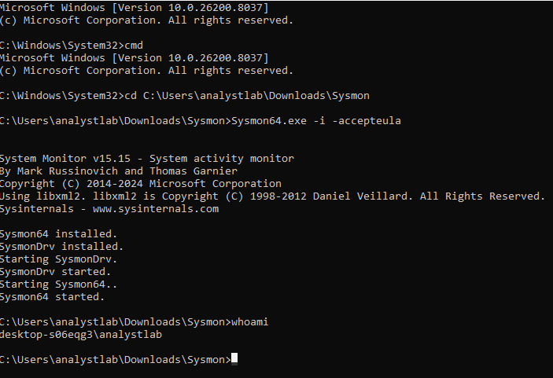

---

## 🔹 systeminfo

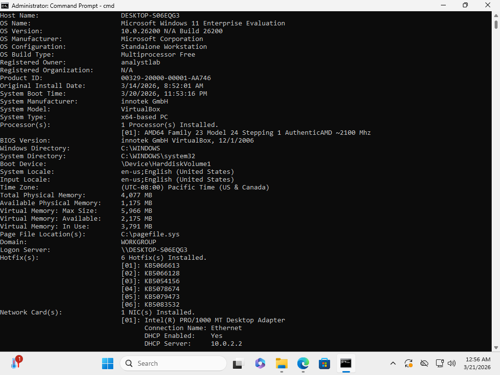

---

## 🔹 net user

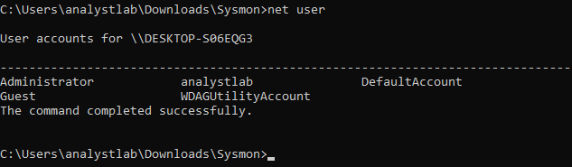

---

## 🔹 whoami /priv

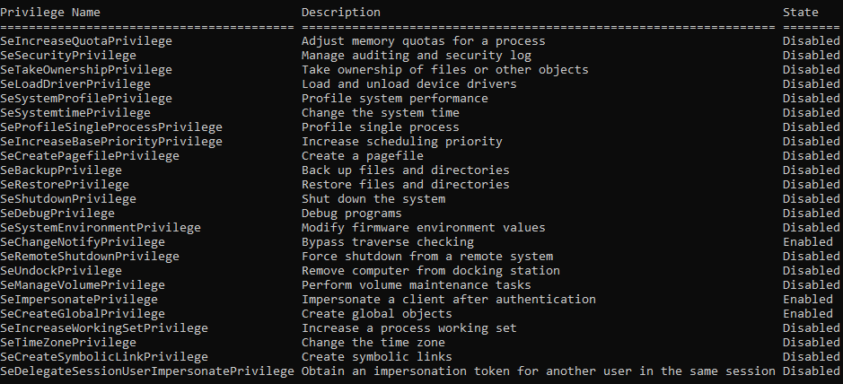

---

## 🔹 PowerShell Execution

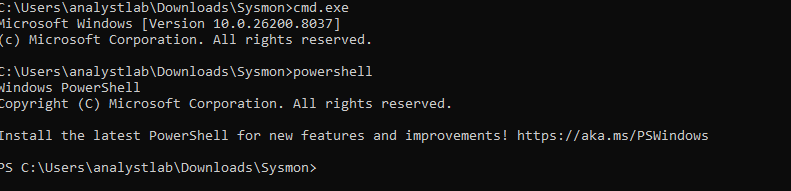

---

## 🔹 Get-Process

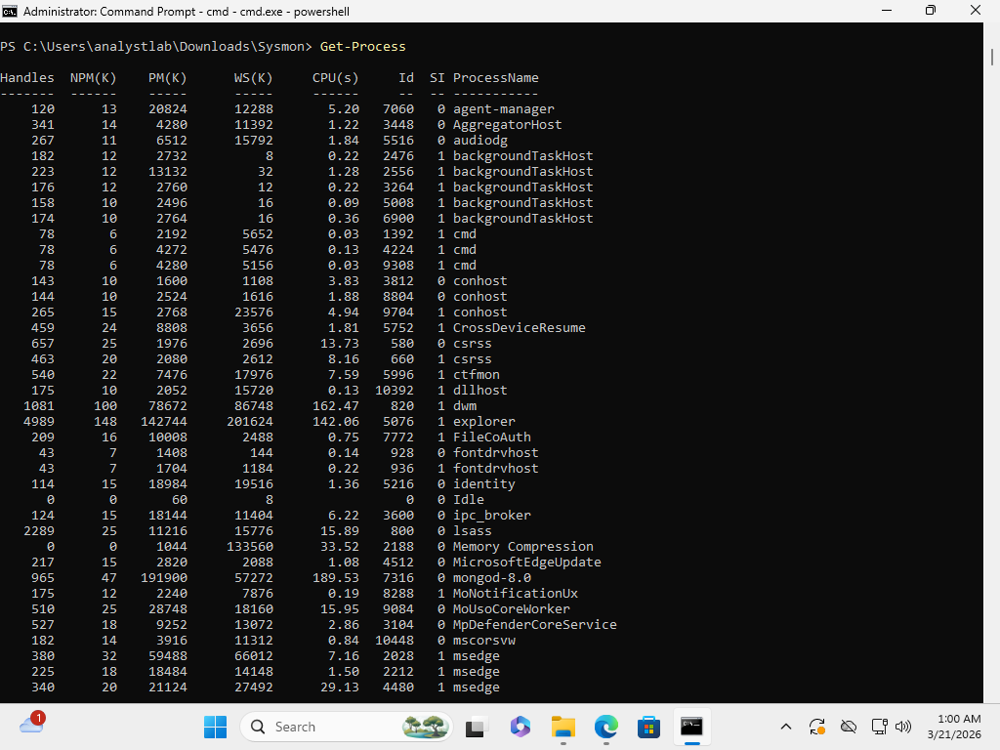

---

# 📡 Log Ingestion

### Sysmon Successfully Sending Logs to Splunk

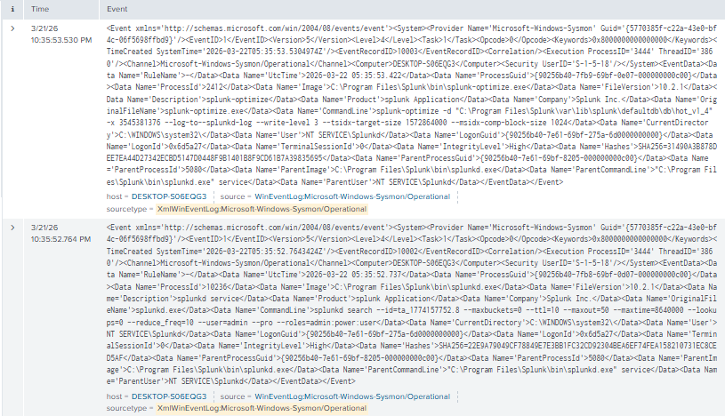

---

# 🔍 Detection in Splunk

---

## 🎯 whoami Detection

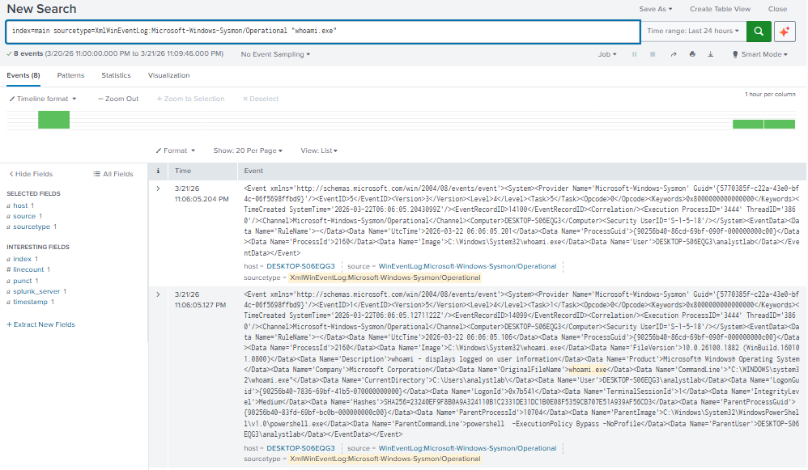

---

## 🌐 ipconfig Detection (Network Reconnaissance)

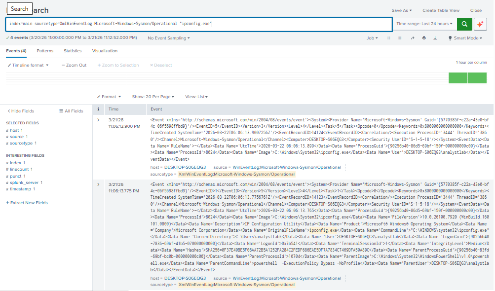

---

## 👤 net.exe Detection (User Enumeration)

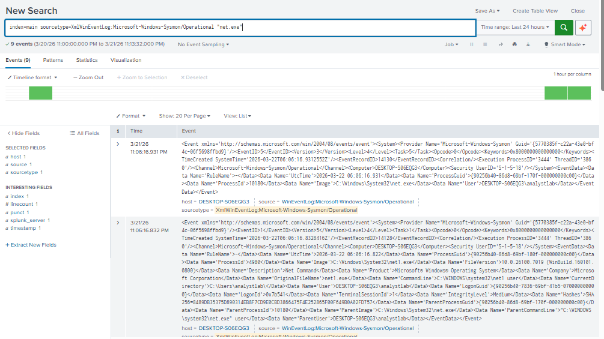

---

## 🌍 netstat Detection (Network Connections Analysis)

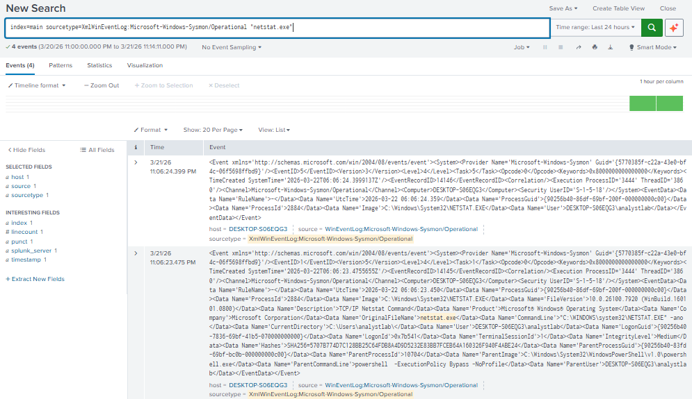

---

## ⚡ PowerShell Detection

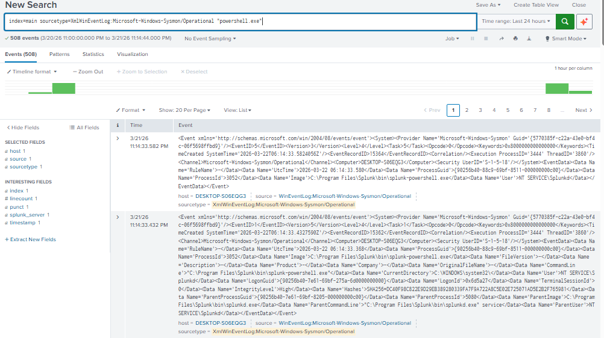

---

## 🔒 Scheduled Task Detection (Persistence Mechanism)

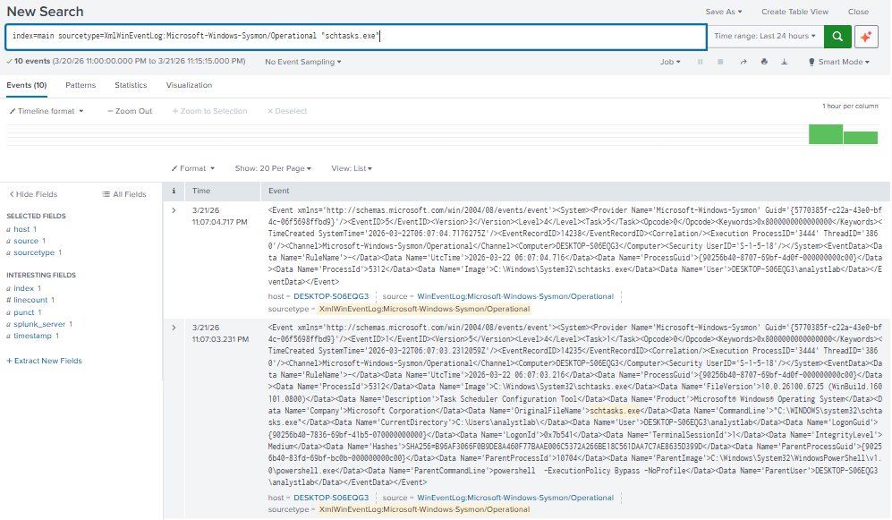

---

# 🧠 Key Findings

- Sysmon Event ID 1 successfully captured all process executions  
- Command-line arguments provided full visibility into attacker activity  
- Reconnaissance commands (`whoami`, `ipconfig`, `net.exe`) were clearly detectable  
- Network enumeration via `netstat` revealed active connections  
- PowerShell activity was logged and easily searchable  
- Persistence activity using scheduled tasks was successfully identified  
- Splunk enabled fast detection and correlation of endpoint behavior  

---

# 🎯 Detection Capabilities

- Process creation monitoring  
- Command-line visibility  
- User and system enumeration detection  
- Network activity monitoring  
- PowerShell execution tracking  
- Persistence detection  
- SIEM-based threat hunting  

---

# 🏁 Conclusion

This project demonstrates how a SOC Analyst can:

- Monitor endpoint activity using Sysmon  
- Detect attacker techniques in real time  
- Use Splunk to investigate and analyze threats  
- Identify suspicious behavior using log data  

---

# 🚀 Future Improvements

- Create Splunk alerts for suspicious activity  
- Map detections to MITRE ATT&CK framework  
- Simulate lateral movement attacks  
- Integrate authentication-based detections (Event ID 4624 / 4625)  
